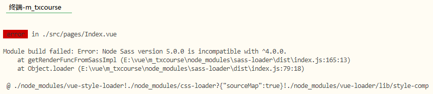

# windows node.js 安装

https://nodejs.org/zh-cn/


# 安装 vue-cli

npm i vue-cli -g --registry=https://registry.npm.taobao.org


# gitee公钥使用

https://gitee.com/profile/sshkeys

ssh-keygen -t rsa -C "427909039@163.com"


```
$ cat ~/.ssh/id_rsa.pub
ssh-rsa AAAAB3NzaC1yc2EAAAADAQABAAABAQDEYD4pyyeTjK2fDwGp1e6ZejTykR9Lijp0X+lvxNpZbo5On/4zvJtfstLZmbJOoVmIrtvc6UAvvMJtsbfHZQQ0zeCWnChVNEsPsbFFCD8IPlQqRbx6SNzrXC65mqJvwCwiOK69jWske6dxlTf2YXk7SAU1PBRdxnG14dJTrNTHRC+pz3bNmAHnvaOjWl1OXdjo18WZ6q2p1zUeuTc5SeuJQyS5x9pO6sT3ItFMXG+/Iki7qpaLw4lWaGCGOYOx2a+86jlc6J9/DvJbAN3Xi56C8FqS6P5gZovZmT+gA5rnCH2/rUHAPkvjRqNwDnyw9EuU6rW8NMWNocBQNEwKFElx 427909039@163.com
```


# 初始化项目

 vue init webpack m_txcourse


## 进入目录

npm run dev


# 安装


# github使用

## 本地推送

git init // 初始化版本库,初始化后会在项目中构建一个git目录

git add . // 添加文件到版本库（只是添加到缓存区），.代表添加文件夹下所有文件

git commit -m "first commit" // 把添加的文件提交到版本库，并填写提交备注

**到目前为止，我们完成了代码库的初始化，但代码是在本地，还没有提交到远程服务器，所以关键的来了，要提交到就远程代码服务器，进行以下两步：**

git remote add origin ''你的远程库地址" // 把本地库与远程库关联

git push -u origin master // 第一次推送时

## 本地提交

```
git一般分:
git add . ->将修改添加至本地缓存
git commit -m 'msg' ->将本地缓存保存到本地仓库中
git push ->将本地仓库推送至服务器
git pull ->将服务器的代码更新到本地仓库中
```

# 安装sass css

```
npm i sass-loader@7 node-sass -D --registry=https://registry.npm.taobao.org
```

### 启动报错

Node Sass version 5.0.0 is incompatible with ^4.0.0.



解决

```
卸载已安装版本 npm uninstall node-sass
安装 npm install node-sass@4.14.1
```

